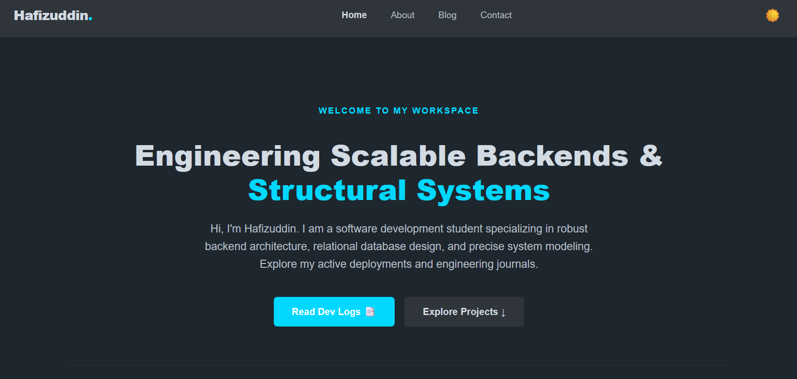
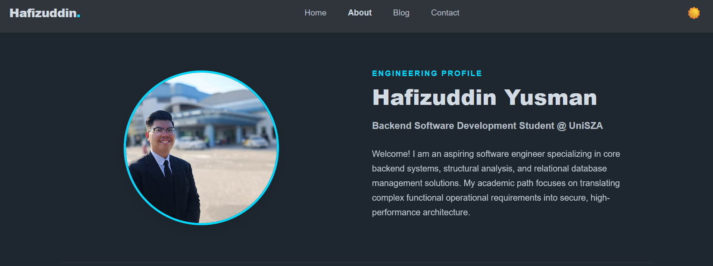
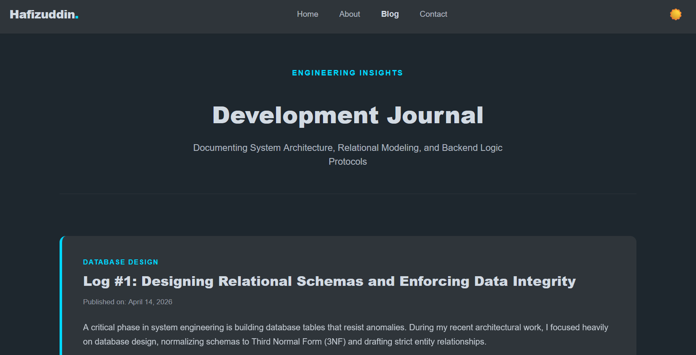
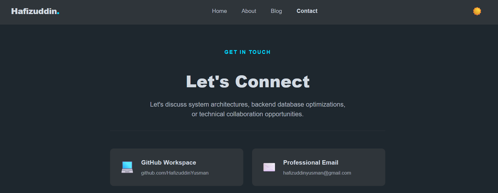
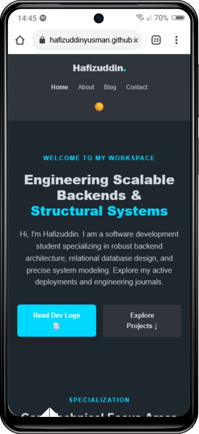
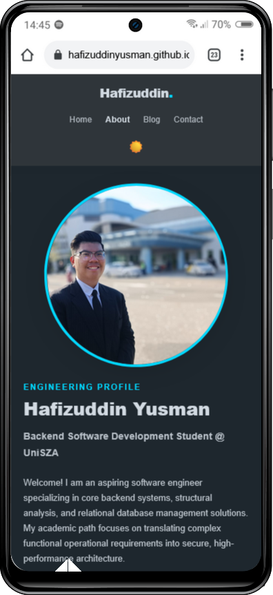
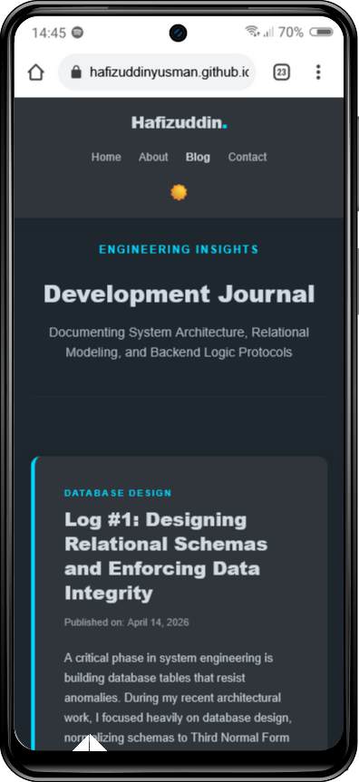
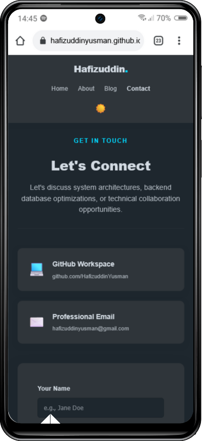

# Developer Portfolio & Technical Dev Journal

## 📌 Project Overview
An interactive, fully responsive personal project portfolio and engineering development journal built for **CSD 34203: Special Topics in Software Development** at **Universiti Sultan Zainal Abidin (UniSZA)**. This platform showcases my professional technical skillset, development tools environment, and deep-dive architectural reflections spanning database design, structural systems analysis, and web framework implementation.

---

## 🚀 Key Features
- **Comprehensive Technical Profile:** Documents an extensive stack of programming capabilities and hands-on IDE experience.
- **Engineering Log Hub:** Incorporates 3 distinct development entries focusing on real-world software system value, database normalization challenges, and MVC routing workflows.
- **Dynamic UX Theme Engine:** Built using pure JavaScript to enable a client-side Light/Dark mode toggle with localStorage state persistence.
- **Fluid Grid Fluidity:** Fully optimized stylesheet layout with CSS media breakpoints to guarantee an excellent mobile-first responsive viewport behavior.
- **Clean Interface Form:** A dedicated contact entry section allowing secure subject-focused collaboration messaging.

---

## 🖥️ Website Preview

### Desktop Preview

<p align="center">
  
  
  <br><br>
  
  
</p>

> Desktop preview showcasing all main pages including the landing page, developer profile, technical blog entries, and contact interface.

---

### Mobile Preview

<p align="center">
  
  
  
  
</p>

> Mobile preview demonstrating responsive layouts, optimized navigation, and mobile-first user experience across all website sections.

--- 

## 🛠️ Technical Skillset & Tools Matrix
- **Languages:** PHP, Python, Java, C#, C++, C, Flutter/Dart, HTML5, CSS3, JavaScript (ES6+)
- **Environments & Engines:** VS Code, Android Studio, NetBeans, Unity Engine
- **Databases & Systems:** MySQL Workbench, XAMPP local environment server, Oracle VirtualBox
- **Data Analytics & Modeling:** Orange (Data Mining Tool), Structural Context Diagrams, Data Flow Diagrams (DFDs)
- **Version Control:** Git, GitHub Ecosystem

---

## 📁 Repository Architecture & Organization
```text
├── index.html          # Landing Showcase Page
├── about.html          # Core Background & Technical Stack Matrix
├── blog.html           # Multi-Topic Engineering Development logs
├── contact.html        # Interactive User Communication Form
├── css/
│   └── style.css       # Custom Theme Variables & Responsive Rules
└── js/
    └── script.js       # Persistence Theme Switch Engine (JS Logic)
